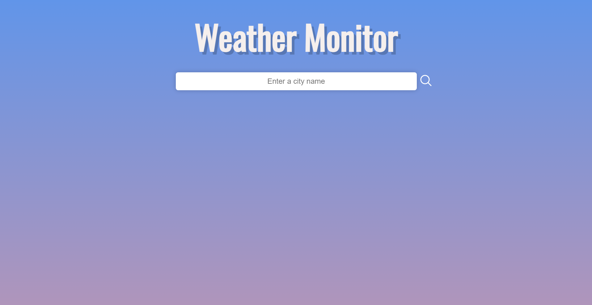
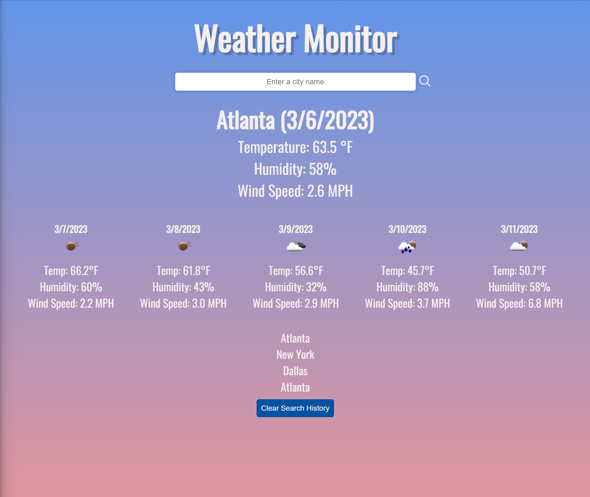

# <weather-monitor>

## Description

Weather-Monitor is a simple weather site that displays real-time weather information for a specified location. The app is built using HTML, CSS, and JavaScript, and uses an API to fetch weather data. Weather-Monitor is designed to be user-friendly and responsive.

## Usage

[Weather Monitor](https://matthewstandish.github.io/weather-monitor/ "Weather Monitor")

## Credits

https://cssgradient.io/

## License

This project is licensed under the [MIT License](https://github.com/MatthewStandish/weather-monitor/blob/main/LICENSE "MIT License")

## Features

- Search for a (city), or search for (city, country)

